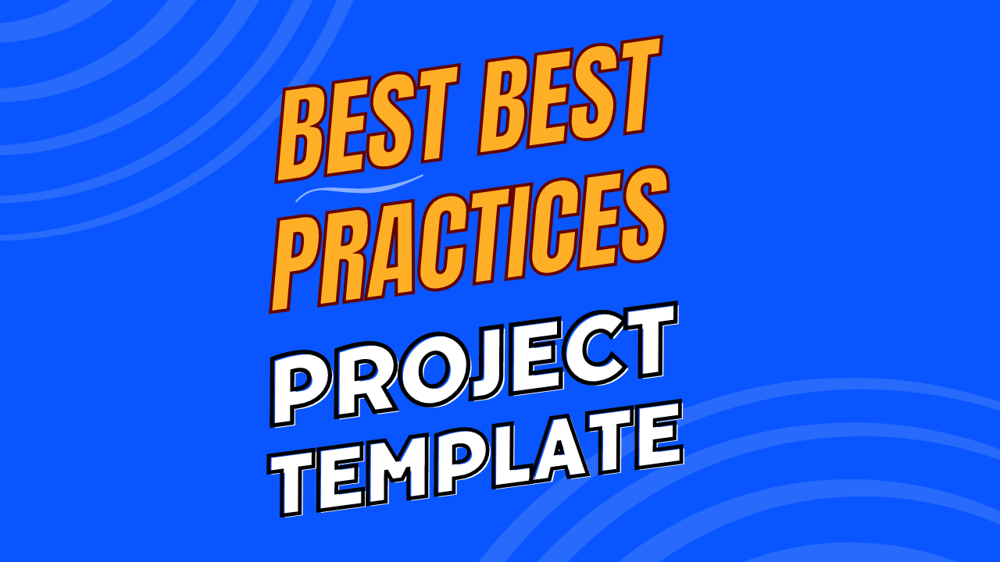

# Unity 6 Optimization Showcase

This repo includes optimization techniques for the Unity game engine.

 

**Getting Started**

1. Download this repo (_.zip or _.git)
1. Download the [Unity Editor](https://store.unity.com/#plans-individual)
1. Open this repo in the Unity Editor
1. Enjoy

 

**Table of Contents**

1. [Videos](#videos)
1. [Features](#features)
1. [Structure](#structure)
1. [Resources](#resources)
1. [Credits](#credits)

 
 

# Videos

This **Unity Project** is featured in the following YouTube video playlist.

<table width="600">
<tr>
<th>Unity Game Dev - In 3 Mins</th>
</tr>
<tr>
<td>

</td>
</tr>
</table>

 
 

# Features

This project is a living list of demos optimization techniques.

 

For each technique there is a demo of **before** and **after** Scene.

### Topics

**Key**

* ✅ = Included now
* 🔜 = Included soon
* ❌ = Included never

**List**

| #   | Title                    | Description                                 | Before | After |
| --- | ------------------------ | ------------------------------------------- | ------ | ----- |
| 1   | Static Batching          | Combine static objects                      | ✅     | ✅    |
| 2   | Level of Detail (LOD)    | Adjust detail based on distance             | ✅     | ✅    |
| 3   | Occlusion Culling        | Prevent rendering hidden objects            | ✅     | ✅    |
| 4   | Texture Atlases          | Combine textures into atlases               | ✅     | ✅    |
| 5   | Physics Optimization     | Use simpler colliders for physics           | ✅     | ✅    |
| 6   | Imposters                | Replace distant objects with 2D             | ✅     | ✅    |
| 7   | Object Pooling           | Reuse instantiated objects                  | 🔜     | 🔜    |
| 8   | Jobs vs OOP vs DOTS      | Compare OOP, Jobs, DOTS                     | 🔜     | 🔜    |
| 9   | ShaderGraph Optimization | Optimize shaders with ShaderGraph           | 🔜     | 🔜    |
| 10  | VFXGraph Optimization    | Optimize effects with VFXGraph              | 🔜     | 🔜    |
| 11  | GPU Instancing           | Render multiple objects with one call       | 🔜     | 🔜    |
| 12  | Lighting Optimization    | Optimize lighting with lightmaps and probes | 🔜     | 🔜    |
| 13  | Sprite Atlases           | Combine sprites into atlases                | 🔜     | 🔜    |
| 14  | Scripting Performance    | Optimize scripting operations               | 🔜     | 🔜    |
| 15  | Memory Performance       | Manage memory and garbage collection        | 🔜     | 🔜    |
| 16  | GPU-Resident Drawer      | Keep draw data on GPU                       | 🔜     | 🔜    |

 
 

# Structure

**Documentation**

- `ReadMe.md` - The primary documentation for this repo
- `Unity/Assets/Documentation/ReadMe.asset` - Select this asset in Unity to get started

**Configuration**

- `Unity Target` - [Standalone MAC/PC](https://support.unity.com/hc/en-us/articles/206336795-What-platforms-are-supported-by-Unity-)
- `Unity Version` - Use this [Version](./Unity/ProjectSettings/ProjectVersion.txt)
- `Unity Rendering` - [Universal Render Pipeline (URP)](https://docs.unity3d.com/Manual/universal-render-pipeline.html)
- `Unity Aspect Ratio` - [Game View 10x16](https://docs.unity3d.com/Manual/GameView.html)

**Structure**

- `Unity/` - Open this folder in the Unity Editor
- `Unity/Assets/Scenes/` - Open any Scene. Press 'Play'!

**Dependencies**

- `Various` - Already included via [Unity Package Manager](https://docs.unity3d.com/Manual/upm-ui.html) as this [Version](./Unity/Packages/manifest.json)

 
 

# Resources

 

**Best Practices**

- <a href="https://www.samuelasherrivello.com/best-practices">Unity — Best Practices (Portfolio)</a>
- <a href="https://github.com/SamuelAsherRivello/unity-best-practices/">Unity — Best Practices (GitHub Repo)</a>

**Optimization**

- <a href="https://www.samuelasherrivello.com/optimization-portfolio/">Unity — Optimization (Portfolio)</a>
- <a href="https://github.com/SamuelAsherRivello/unity-optimization">Unity — Optimization (GitHub Repo)</a>

 
 

# Credits

### Created By

- Samuel Asher Rivello
- Over 25 years XP with game development (2024)
- Over 11 years XP with Unity (2024)

### Contact

- Twitter - <a href="https://twitter.com/srivello/">@srivello</a>
- Git - <a href="https://github.com/SamuelAsherRivello/">Github.com/SamuelAsherRivello</a>
- Resume & Portfolio - <a href="http://www.SamuelAsherRivello.com">SamuelAsherRivello.com</a>
- LinkedIn - <a href="https://Linkedin.com/in/SamuelAsherRivello">Linkedin.com/in/SamuelAsherRivello</a> <--- Say Hello! :)

### License

Provided as-is under MIT License | Copyright © 2024 Rivello Multimedia Consulting, LLC
